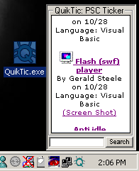



## QuikTic: PSC Ticker

### Description

This is a very neat little ticker that displays new submitted code just like the one on the left.

It also has a cool Point-and-Search feature that doesnt require you to click the textbox, just move the mouse to the bottom left and start typing. Oh and when you click on any link, it will open it in your default browser, not inside itself like others have it. Please Vote and tell me any suggestions :)
 
### More Info
 

             |
---                |---
**Submitted On**   |2000-10-28 14:28:38
**By**             |[Jarem Archer](https://github.com/Planet-Source-Code/PSCIndex/blob/master/ByAuthor/jarem-archer.md)
**Level**          |Intermediate
**User Rating**    |4.8 (53 globes from 11 users)
**Compatibility**  |VB 6\.0
**Category**       |[Complete Applications](https://github.com/Planet-Source-Code/PSCIndex/blob/master/ByCategory/complete-applications__1-27.md)
**World**          |[Visual Basic](https://github.com/Planet-Source-Code/PSCIndex/blob/master/ByWorld/visual-basic.md)
**Archive File**   |[CODE\_UPLOAD1102710282000\.zip](https://github.com/Planet-Source-Code/jarem-archer-quiktic-psc-ticker__1-12357/archive/master.zip)

